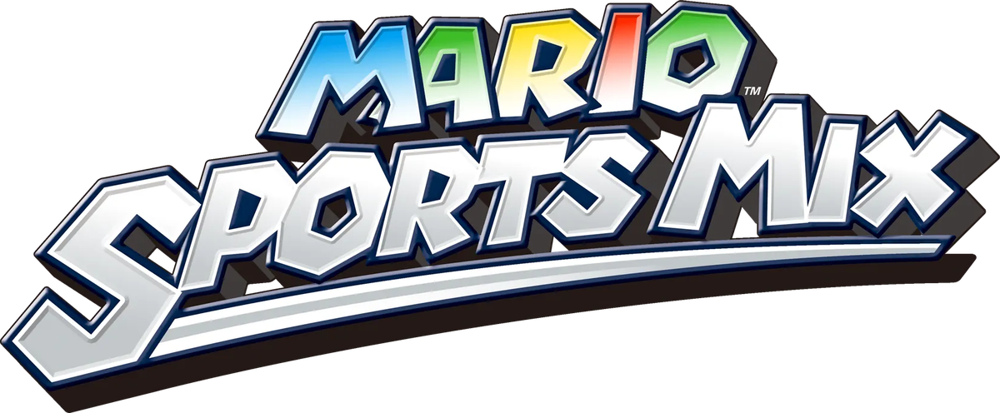

# Mario Sports Mix Patch

<p align="center"></p>

Classic Controller and GameCube controller support for **Mario Sports Mix** (Wii), in all three retail releases:

| Region | ID |
|---|---|
| USA | `RMKE01` |
| Europe | `RMKP01` |
| Japan | `RMKJ01` |

The Classic Controller patch is built on the Gecko codes by **Vague Rant**
([GBAtemp](https://gbatemp.net/threads/new-classic-controller-hacks.659837/)); they are included here unchanged
and converted to static patches. The GameCube controller patch is new: the game has no PAD library, so the patch
switches on the console's controller port polling itself and feeds the pad into the game as a Classic Controller
(the same idea as [this gist](https://gist.github.com/quatric/257a40993345c2c7568b9154c00186fd)).

## Use it

The patcher takes **your own** `.wbfs` / `.iso`, patches its `main.dol`, and rebuilds the image in place
(the original is kept as `<name>.bak`).

```
python3 tools/gui.py                                   # drag-and-drop window
python3 tools/patch_disc.py "Mario Sports Mix (USA).wbfs" --cc --gc   # command line
```

It needs [`wit`](https://wit.wiimm.de/) (Wiimms ISO Tool) on `PATH` (bundled in the release builds) and, for the GUI, Python with tkinter
(`pip install tkinterdnd2` for drag and drop). Release builds are made by `.github/workflows/build-gui.yml`.

No game files are shipped, and none may be committed (see `.gitignore`).

Other install methods, generated from the same patch data:

* `codes/<ID>.ini` / `.txt` - Gecko codes (Dolphin, USB Loader GX, ...)
* `riivolution/<ID>.xml` - Riivolution patch

The patched disc is the recommended way. The patches keep a few helper routines in low memory
(`0x80001820-0x80003000`), where a Gecko code handler lives too, so the Gecko form is meant for
the Classic Controller codes; the GameCube-pad Gecko code is **untested**.

## GameCube controller

Port *N* plays as Wii Remote *N*. **A Wii Remote must still be connected** (the game's pairing / player slots
are driven by it), and the pad should be plugged in before the game boots.

| GameCube | Plays as Classic Controller |
|---|---|
| Control stick | Left stick |
| C-stick | Right stick |
| A / B / X / Y | A / B / X / Y |
| Z | ZL |
| R | ZR |
| L | L |
| Start | + |
| D-pad | D-pad |
| L + R + Start | Home |

The Classic Controller then behaves exactly as Vague Rant's codes define it.

## Status

| | USA | Europe | Japan |
|---|---|---|---|
| Classic Controller - all buttons, sticks | verified (Dolphin) | verified (Dolphin) | verified (Dolphin) |
| GameCube controller - all buttons, sticks | verified (Dolphin) | verified (Dolphin) | verified (Dolphin) |
| Patcher on a real disc image | - | - | verified (Dolphin boots result, re-run is a no-op) |
| Real console | **not tested** | **not tested** | **not tested** |

"Verified" means: scripted input into Dolphin, the game's own KPAD state read back over Dolphin's GDB stub
(`lab/`, see `docs/TECHNICAL.md`). Nobody has played it on hardware yet - reports welcome.

Known limits: a Wii Remote must stay connected in GameCube mode; unplugging the pad mid-game falls back to the remote.

## Releasing

```
python3 tools/release.py 1.0.0 --dry-run   # regenerate + check, change nothing
python3 tools/release.py 1.0.0             # tag v1.0.0 and push; CI builds and attaches the downloads
```

`tools/release.py` needs a clean `main`, rebuilds `codes/` and `riivolution/`, runs `tools/check.py` (and
`tools/verify.py` when `MSM_DOLS` points at retail DOLs), then pushes the tag. The workflow builds the patcher for
macOS, Linux and Windows and attaches it with the Gecko and Riivolution zips.

## Credits

* Classic Controller codes: **Vague Rant**
* GameCube pad support, patcher, tooling: **quatric**
* Disc handling: Wiimms ISO Tool (`wit`)

MIT licensed (see `LICENSE`).

### Modded images

Disc patchers match the first four characters of the game ID (ID4), so mods can change the last two characters. The original disc ID and filename are preserved. Revision and executable patch-site checks still apply; mods that change required code may be incompatible.
